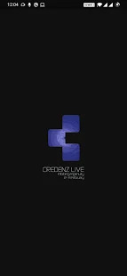
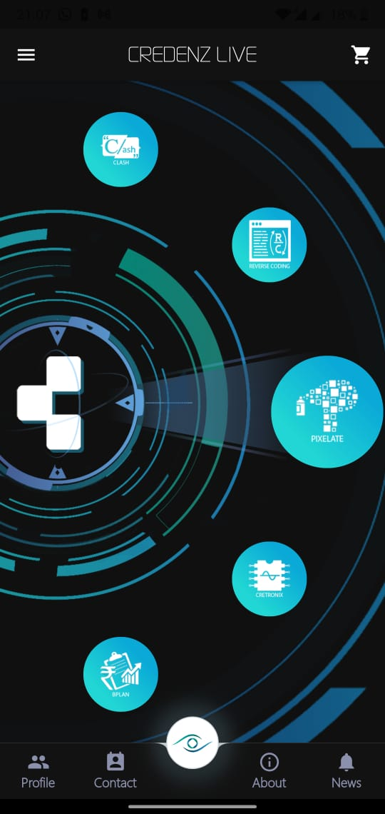
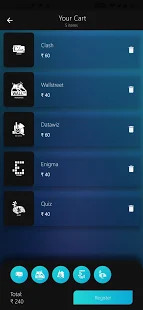
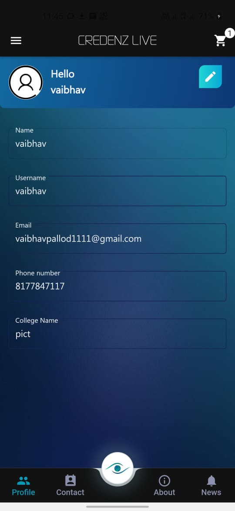

# Credenz Live

Credenz is the annual technical fest organised by PICT IEEE Student Branch. It has grown by leaps and bounds ever since it started in 2004.
This year the app comes with great UI and you can register for all the events in one click.

Video
-----

Pictures
-----
&nbsp;&nbsp;&nbsp;&nbsp;&nbsp;

&nbsp;&nbsp;&nbsp;&nbsp;&nbsp;

&nbsp;&nbsp;&nbsp;&nbsp;&nbsp;

## Download & install

First, clone the repository with the 'clone' command, or just download the zip.

$ git clone https://github.com/credenz/Credenz20_Flutter_App.git

Then, download either Android Studio or Visual Studio Code, with their respective [Flutter editor plugins](https://flutter.io/get-started/editor/). For more information about Flutter installation procedure, check the [official install guide](https://flutter.io/get-started/install/).

Install dependencies from pubspec.yaml by running `flutter packages get` from the project root (see [using packages documentation](https://flutter.io/using-packages/#adding-a-package-dependency-to-an-app) for details and how to do this in the editor).

There you go, you can now open & edit the project. Enjoy!

#### Dependencies
+ [Firebase](https://firebase.flutter.dev/docs/overview/)
+ [Font Awesome Flutter](https://pub.dev/packages/font_awesome_flutter)
+ [Geocoder](https://pub.dev/packages/geocoder)
+ [Google Sign In](https://pub.dev/packages/google_sign_in)
+ [Image Picker](https://pub.dev/flutter/packages?platform=android)
+ [Intl](https://pub.dev/packages/intl)
+ [Percent Indicator](https://pub.dev/packages/percent_indicator)
+ [Animated Theme Switcher](https://pub.dev/packages/animated_theme_switcher)
+ [Cached Network Image](https://pub.dev/packages/cached_network_image)
+ [Secure Storage](https://pub.dev/packages/flutter_secure_storage)
+ 

## Built with

- [Flutter](https://flutter.dev/) - Beautiful native apps in record time.
- [Android Studio](https://developer.android.com/studio/index.html/) - Tools for building apps on every type of Android device.
- [Visual Studio Code](https://code.visualstudio.com/) - Code editing. Redefined.

